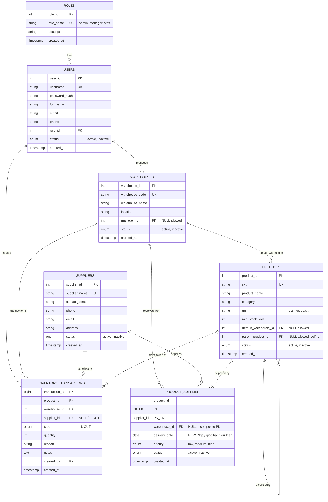

# 🗄️ WAREHOUSE MANAGEMENT - ERD (Entity Relationship Diagram)

**Date:** 7/11/2025  
**Version:** 3.0 (After removing price fields)

---

## 📊 MERMAID ERD DIAGRAM



---

## 🔑 KEY CHANGES IN v3.0

### **PRODUCT_SUPPLIER Table:**

**REMOVED (❌):**
- ~~`default_price DECIMAL(15,2)`~~ - Giá mặc định đã bị XÓA
- ~~`delivery_time INT`~~ - Thời gian giao hàng (ngày) đã bị XÓA

**ADDED (✅):**
- `delivery_date DATE` - Ngày giao hàng dự kiến (Date picker trong UI)

**KEPT (✓):**
- `product_id` (PK, FK)
- `supplier_id` (PK, FK)
- `warehouse_id` (FK, nullable - part of composite key)
- `priority` ENUM('low', 'medium', 'high')
- `status` ENUM('active', 'inactive')
- `created_at` TIMESTAMP

---

## 📋 TABLES OVERVIEW

| # | Table | Records | Primary Key | Description |
|---|-------|---------|-------------|-------------|
| 1 | `roles` | ~3 | role_id | Vai trò: admin, manager, staff |
| 2 | `users` | Many | user_id | Người dùng hệ thống |
| 3 | `warehouses` | Many | warehouse_id | Kho hàng |
| 4 | `suppliers` | Many | supplier_id | Nhà cung cấp |
| 5 | `products` | Many | product_id | Sản phẩm |
| 6 | **`product_supplier`** | Many | **(product_id, supplier_id, warehouse_id)** | **Quan hệ N-N-N (UPDATED)** |
| 7 | `inventory_transactions` | Many | transaction_id | Giao dịch nhập/xuất |

---

## 🔗 RELATIONSHIPS DETAIL

### **1. Users ↔ Roles (N:1)**
```
users.role_id → roles.role_id
```
- Mỗi user có 1 role
- 1 role có nhiều users

---

### **2. Users ↔ Warehouses (1:N)**
```
warehouses.manager_id → users.user_id (nullable)
```
- Mỗi kho có 1 người quản lý (hoặc không)
- 1 user có thể quản lý nhiều kho

---

### **3. Products ↔ Warehouses (N:1)**
```
products.default_warehouse_id → warehouses.warehouse_id (nullable)
```
- Mỗi sản phẩm có 1 kho mặc định (hoặc không)
- 1 kho là mặc định cho nhiều sản phẩm

---

### **4. Products ↔ Products (Self-Referencing)**
```
products.parent_product_id → products.product_id (nullable)
```
- Sản phẩm có thể có sản phẩm cha (biến thể, phụ kiện)
- 1 sản phẩm cha có nhiều sản phẩm con

---

### **5. Products ↔ Suppliers ↔ Warehouses (N:N:N) ⭐**
```sql
product_supplier (
    product_id FK → products.product_id,
    supplier_id FK → suppliers.supplier_id,
    warehouse_id FK → warehouses.warehouse_id (nullable),
    delivery_date DATE,           -- ✅ NEW
    priority ENUM,
    status ENUM,
    PRIMARY KEY (product_id, supplier_id, warehouse_id)
)
```

**Ý nghĩa:**
- Nhà cung cấp X cung cấp sản phẩm Y cho kho Z
- Ngày giao hàng dự kiến: `delivery_date`
- Độ ưu tiên: `priority` (low/medium/high)

**Ví dụ:**
| product | supplier | warehouse | delivery_date | priority |
|---------|----------|-----------|---------------|----------|
| Laptop Dell | Công ty ABC | Kho HN | 2025-12-15 | high |
| Mouse Logitech | Công ty XYZ | Kho HCM | 2025-11-20 | medium |

---

### **6. Inventory Transactions**

**IN (Nhập kho):**
```
transaction → product + warehouse + supplier + quantity + reason
```

**OUT (Xuất kho):**
```
transaction → product + warehouse + quantity + reason (supplier = NULL)
```

---

## 📐 COMPOSITE PRIMARY KEY

### **product_supplier table:**

```sql
PRIMARY KEY (product_id, supplier_id, warehouse_id)
```

**Giải thích:**
- Cùng 1 nhà cung cấp có thể cung cấp cùng 1 sản phẩm cho nhiều kho khác nhau
- Mỗi tổ hợp (sản phẩm, nhà cung cấp, kho) là DUY NHẤT

**Ví dụ hợp lệ:**
```
(Laptop, ABC, Kho_HN)  ✓
(Laptop, ABC, Kho_HCM) ✓
(Laptop, XYZ, Kho_HN)  ✓
```

**Ví dụ trùng (lỗi):**
```
(Laptop, ABC, Kho_HN) 
(Laptop, ABC, Kho_HN) ✗ DUPLICATE!
```

---

## 🎯 USE CASES

### **Use Case 1: Tìm nhà cung cấp của sản phẩm**
```sql
SELECT s.supplier_name, ps.delivery_date, ps.priority
FROM product_supplier ps
JOIN suppliers s ON ps.supplier_id = s.supplier_id
WHERE ps.product_id = 5 AND ps.status = 'active';
```

---

### **Use Case 2: Tìm sản phẩm từ nhà cung cấp giao đến kho nào**
```sql
SELECT p.product_name, w.warehouse_name, ps.delivery_date
FROM product_supplier ps
JOIN products p ON ps.product_id = p.product_id
JOIN warehouses w ON ps.warehouse_id = w.warehouse_id
WHERE ps.supplier_id = 3 AND ps.status = 'active';
```

---

### **Use Case 3: Sản phẩm giao hàng trong tháng này**
```sql
SELECT p.product_name, s.supplier_name, ps.delivery_date
FROM product_supplier ps
JOIN products p ON ps.product_id = p.product_id
JOIN suppliers s ON ps.supplier_id = s.supplier_id
WHERE ps.delivery_date BETWEEN '2025-11-01' AND '2025-11-30'
ORDER BY ps.delivery_date;
```

---

### **Use Case 4: Nhà cung cấp ưu tiên cao**
```sql
SELECT s.supplier_name, COUNT(*) as product_count
FROM product_supplier ps
JOIN suppliers s ON ps.supplier_id = s.supplier_id
WHERE ps.priority = 'high' AND ps.status = 'active'
GROUP BY s.supplier_id
ORDER BY product_count DESC;
```

---

## 📊 CARDINALITY SUMMARY

| Relationship | Type | Description |
|--------------|------|-------------|
| User → Role | N:1 | Many users, 1 role |
| Warehouse → Manager | N:1 | Many warehouses, 1 manager |
| Product → Default Warehouse | N:1 | Many products, 1 default warehouse |
| Product → Parent Product | N:1 | Many children, 1 parent |
| **Product ↔ Supplier ↔ Warehouse** | **N:N:N** | **Complex many-to-many-to-many** |
| Transaction → Product | N:1 | Many transactions, 1 product |
| Transaction → Warehouse | N:1 | Many transactions, 1 warehouse |
| Transaction → Supplier | N:1 | Many transactions, 1 supplier |
| Transaction → User | N:1 | Many transactions, 1 creator |

---

## 🎨 VISUAL REPRESENTATION (ASCII)

```
┌─────────┐         ┌─────────┐
│  ROLES  │1──────N│  USERS  │
└─────────┘         └────┬────┘
                         │
                         │manages
                         │
                    ┌────▼────────┐
                    │ WAREHOUSES  │
                    └─────┬───────┘
                          │
         ┌────────────────┼────────────────┐
         │                │                │
    default_wh      receives_from      txn_in
         │                │                │
    ┌────▼────┐     ┌─────▼──────┐   ┌───▼──────┐
    │PRODUCTS │N───N│PRODUCT_    │   │INVENTORY │
    │         │     │SUPPLIER    │   │TRANS.    │
    └────┬────┘     └─────┬──────┘   └───┬──────┘
         │                │                │
    parent_child     ┌────▼────┐          │
         │           │SUPPLIERS│          │
         └───────────┴─────────┴──────────┘
```

---

## ⚡ INDEXES RECOMMENDATIONS

```sql
-- Product_Supplier indexes
CREATE INDEX idx_ps_product ON product_supplier(product_id);
CREATE INDEX idx_ps_supplier ON product_supplier(supplier_id);
CREATE INDEX idx_ps_warehouse ON product_supplier(warehouse_id);
CREATE INDEX idx_ps_delivery ON product_supplier(delivery_date);
CREATE INDEX idx_ps_priority ON product_supplier(priority);

-- Products indexes
CREATE INDEX idx_prod_warehouse ON products(default_warehouse_id);
CREATE INDEX idx_prod_parent ON products(parent_product_id);

-- Warehouses indexes
CREATE INDEX idx_wh_manager ON warehouses(manager_id);

-- Transactions indexes
CREATE INDEX idx_txn_product ON inventory_transactions(product_id);
CREATE INDEX idx_txn_warehouse ON inventory_transactions(warehouse_id);
CREATE INDEX idx_txn_supplier ON inventory_transactions(supplier_id);
CREATE INDEX idx_txn_created ON inventory_transactions(created_at);
```

---

## 🎯 SUMMARY

**Total Tables:** 7  
**Total Relationships:** 11  
**Complex Junction Table:** 1 (`product_supplier` with N:N:N)  
**Self-Referencing:** 1 (`products.parent_product_id`)  

**Key Features:**
- ✅ Removed pricing information (no more `default_price`)
- ✅ Date-based delivery tracking (`delivery_date` instead of `delivery_time`)
- ✅ Flexible warehouse assignment (nullable)
- ✅ Priority-based supplier management
- ✅ Product hierarchy support (parent-child)
- ✅ Full transaction history
- ✅ Role-based access control

---

**Diagram generated on:** 7/11/2025  
**Database:** MySQL 8.0+  
**Encoding:** UTF-8
